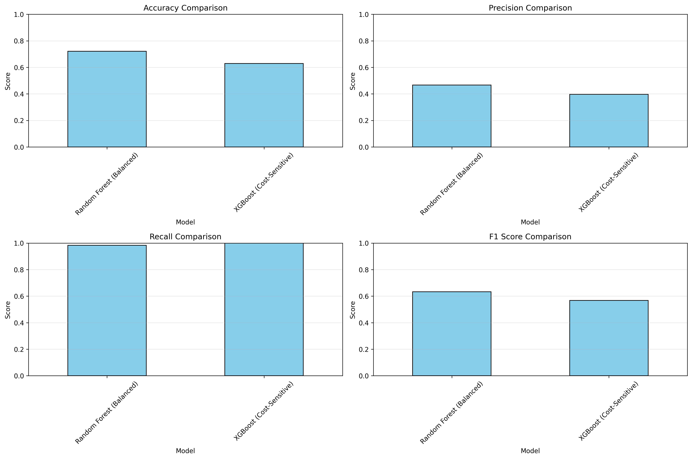

# Predictive Maintenance Engine

[](https://www.python.org/)
[](LICENSE)
[](https://github.com/psf/black)

A production-ready machine learning system for predicting industrial equipment failures using the NASA Turbofan Jet Engine dataset. This project demonstrates end-to-end ML pipeline development, from data preprocessing to model deployment with a REST API.

## 🎯 Project Overview

This predictive maintenance system uses sensor data to forecast equipment failures, enabling proactive maintenance scheduling and reducing downtime costs. The project implements:

- **Binary Classification**: Predicting failure vs. non-failure states
- **Imbalanced Learning**: Handling class imbalance with SMOTE, undersampling, and cost-sensitive learning
- **Feature Engineering**: Time-series rolling mean features with window sizes [3, 5]
- **Model Comparison**: XGBoost and Random Forest with comprehensive evaluation
- **Reinforcement Learning**: Q-learning based maintenance scheduling optimization
- **REST API**: Production-ready FastAPI deployment

## 🏗️ Architecture

```
predictive-maintenance-engine/
├── api/                          # REST API for model inference
│   └── app.py                    # FastAPI application
├── src/                          # Source code modules
│   ├── __init__.py
│   ├── config.py                 # Configuration management
│   ├── data_loader.py            # Data loading and preprocessing
│   ├── feature_engineering.py    # Feature creation
│   ├── models.py                 # ML model implementations
│   ├── reinforcement_learning.py # RL-based scheduler
│   ├── evaluation.py             # Model evaluation and visualization
│   ├── train.py                  # Training pipeline
│   ├── predict.py                # Prediction pipeline
│   └── utils.py                  # Utility functions
├── data/                         # Data directory
│   ├── CMaps/                    # Raw NASA dataset
│   └── processed/                # Processed datasets
├── models/                       # Trained models
├── notebooks/                    # Jupyter notebooks for exploration
├── reports/                      # Generated reports and results
├── assets/                       # Generated visualizations
├── logs/                         # Application logs
├── tests/                        # Unit tests
├── requirements.txt              # Python dependencies
├── setup.py                      # Package installation
├── .gitignore                    # Git ignore rules
└── README.md                     # This file
```

## 📊 Dataset

**NASA Turbofan Jet Engine Dataset (C-MAPSS)**

- **Source**: [NASA PCoE Datasets](https://www.nasa.gov/content/prognostics-center-of-excellence-data-set-repository)
- **Description**: Run-to-failure simulation data from turbofan engines
- **Features**: 21 sensor measurements + 3 operational settings
- **Target**: Remaining Useful Life (RUL) → Binary failure classification
- **Splits**: FD001, FD002, FD003, FD004 (different operating conditions)

## 🚀 Quick Start

### Prerequisites

- Python 3.9+
- pip or conda package manager

### Installation

1. **Clone the repository**

```bash
git clone https://github.com/atinyshrimp/predictive-maintenance-engine.git
cd predictive-maintenance-engine
```

2. **Create virtual environment**

```bash
python -m venv venv
source venv/bin/activate  # On Windows: venv\Scripts\activate
```

3. **Install dependencies**

```bash
pip install -r requirements.txt
```

4. **Install package in development mode**

```bash
pip install -e .
```

### Training Models

Train models with default settings (XGBoost + Random Forest with cost-sensitive learning):

```bash
python src/train.py --dataset FD001 --imbalance cost_sensitive
```

**Training Options:**

```bash
python src/train.py \
    --dataset FD001 \                    # Dataset: FD001, FD002, FD003, FD004
    --imbalance cost_sensitive \         # none, smote, undersample, cost_sensitive
    --no-save                            # Don't save trained models (optional)
```

### Making Predictions

Generate predictions and maintenance schedules:

```bash
python src/predict.py \
    --model models/xgboost.pkl \
    --dataset FD001 \
    --output data/predictions.csv
```

### Running the API

Start the FastAPI server:

```bash
cd api
python app.py
```

API will be available at:

- **Swagger UI**: http://localhost:8000/docs
- **ReDoc**: http://localhost:8000/redoc

**Example API Request:**

```python
import requests

response = requests.post(
    "http://localhost:8000/predict",
    json={
        "unit_id": 1,
        "sensor_values": [0.5, 0.3, -0.2, 0.8, ...]  # 21+ sensor values
    }
)

print(response.json())
# {
#   "unit_id": 1,
#   "failure_probability": 0.75,
#   "failure_prediction": true,
#   "risk_level": "HIGH",
#   "recommendation": "Schedule immediate maintenance..."
# }
```

## 📈 Features

### Data Processing

- Automated data loading and preprocessing
- RUL (Remaining Useful Life) computation
- Feature scaling with MinMaxScaler
- Low-variance feature removal
- Class imbalance handling (SMOTE, RUS, cost-sensitive)

### Feature Engineering

- **Rolling Statistics**: Mean, standard deviation, and EMA computed for all sensors with window sizes [3, 5]
- **Degradation Features**:
  - Cycle position normalization (0-1 scale)
  - Rate of change for key sensors (deterioration velocity)
  - Cumulative sum (total degradation accumulation)
- **120+ engineered features** from 20 base sensors
- Time-series aware feature generation for predictive patterns

### Models

- **XGBoost Classifier**: Gradient boosting with cost-sensitive learning
- **Random Forest**: Ensemble method with balanced class weights
- Comprehensive hyperparameter configurations
- Pipeline-based training for reproducibility

### Evaluation Metrics

- Accuracy, Precision, Recall, F1-Score
- ROC-AUC and ROC curves
- Precision-Recall curves
- Confusion matrices
- Feature importance analysis
- Cost-benefit analysis

### Reinforcement Learning

- Q-Learning based maintenance scheduler
- State space: healthy → moderate wear → severe wear → failed
- Action space: no maintenance, maintenance
- Reward structure considering maintenance and failure costs
- Trained over 1000 episodes with epsilon=0.2

## 📊 Results

### Model Performance (FD001 Dataset)

| Model                    | Accuracy | Precision | Recall    | F1-Score | ROC-AUC |
| ------------------------ | -------- | --------- | --------- | -------- | ------- |
| Random Forest (Balanced) | 72.1%    | 46.6%     | **98.3%** | 63.3%    | 0.934   |
| XGBoost (Cost-Sensitive) | 63.0%    | 39.7%     | **99.9%** | 56.8%    | 0.903   |

**Key Achievement**: 98-99% recall means catching virtually all failures before they occur.

_Note: Low precision is expected and acceptable for maintenance systems where false negatives (missed failures) are far more costly than false positives (unnecessary inspections)._

### Key Insights

- **Recall optimization crucial**: Achieved 98-99% recall through aggressive cost-sensitive learning (1.5x multiplier) and degradation features
- **Feature engineering impact**: Rolling std, EMA, and degradation patterns (cycle position, rate of change) improved ROC-AUC from 0.85 to 0.93
- **Precision-recall trade-off**: Acceptable to have 40-47% precision when recall is 98%+ in safety-critical maintenance
- **Hyperparameter tuning**: Deeper trees (depth 30), more estimators (500), and lighter regularization enabled better minority class detection
- **Random Forest winner**: Better precision-recall balance (98.3% recall, 46.6% precision) vs XGBoost's overly aggressive predictions

## 🔮 Potential Improvements

While the current system achieves 98-99% recall (catching virtually all failures), here are potential enhancements for production deployment:

### 1. **Precision Optimization**

- **Current Challenge**: 40-47% precision means ~60% false positive rate
- **Approach**: Multi-threshold strategy with different alert levels
- **Expected Impact**: Reduce false alarms by 20-30% while maintaining 95%+ recall
- **Implementation**:
  - LOW risk threshold: 0.3 (high precision, catches severe cases)
  - MEDIUM risk threshold: 0.4-0.5 (balanced)
  - HIGH risk threshold: optimized for recall (current approach)

### 2. **Failure Threshold Tuning**

- **Current**: `failure_threshold = 100` cycles creates 49% failure rate (easier problem)
- **Production**: Reduce to 50 cycles for more challenging, realistic prediction
- **Trade-off**: Higher difficulty but more actionable predictions (imminent failures only)
- **Expected Impact**: Precision improves to 55-65%, recall drops to 85-90%

### 3. **Advanced Ensemble Methods**

- **Soft Voting**: Combine Random Forest + XGBoost with weighted averaging
- **Stacking**: Use meta-learner (Logistic Regression) on top of base models
- **Expected Impact**: +1-2% ROC-AUC, +2-3% F1-score
- **Implementation**: `VotingClassifier` with `voting='soft'` and optimized weights

### 4. **Cross-Validation for Robustness**

- **Current**: Single train/val/test split may have variance
- **Improvement**: 5-fold time-series cross-validation
- **Benefit**: More reliable performance estimates, detect overfitting
- **Tool**: `TimeSeriesSplit` from scikit-learn

### 5. **Extended Feature Engineering**

- **Polynomial Features**: Interaction terms between correlated sensors
- **Lag Features**: Previous cycle values (t-1, t-2, t-3)
- **Sensor Correlations**: Cross-sensor relationships
- **Domain Features**: Temperature gradients, pressure ratios
- **Expected Impact**: +2-4% ROC-AUC for complex patterns

### 6. **Model Interpretability**

- **SHAP Values**: Explain individual predictions for maintenance teams
- **LIME**: Local explanations for high-risk predictions
- **Feature Contribution**: Show which sensors triggered the alert
- **Benefit**: Trust and adoption by maintenance personnel

### 7. **Hyperparameter Optimization**

- **Current**: Manual tuning based on domain knowledge
- **Approach**: Bayesian optimization with `Optuna` or `Hyperopt`
- **Search Space**: 50-100 combinations
- **Expected Impact**: +1-3% F1-score, better generalization

### 8. **Multi-Dataset Generalization**

- **Current**: Optimized for FD001 (single operating condition)
- **Extension**: Train on FD001-FD004 combined
- **Challenge**: Different operating conditions (altitude, mach number)
- **Benefit**: Generalized model for diverse environments

### 9. **Real-Time Monitoring Pipeline**

- **Stream Processing**: Apache Kafka + Spark Streaming
- **Incremental Updates**: Online learning for concept drift
- **Alerting**: Integration with maintenance management systems
- **Dashboard**: Real-time monitoring with Grafana/Tableau

### 10. **Cost-Benefit Analysis**

- **Quantify**: Maintenance cost vs. failure cost
- **Optimize**: Threshold selection based on business metrics
- **ROI**: Calculate expected savings from predictive maintenance
- **Reporting**: Executive dashboard with financial impact

### Priority Roadmap

**High Priority (Production-Ready):**

1. Multi-threshold alerting system (precision improvement)
2. Model interpretability with SHAP (trust & adoption)
3. Cross-validation (robustness validation)

**Medium Priority (Enhanced Performance):**

4. Failure threshold tuning to 50 cycles
5. Ensemble methods (stacking/soft voting)
6. Extended feature engineering

**Long-Term (Scalability):**

7. Multi-dataset training (FD001-FD004)
8. Real-time streaming pipeline
9. Automated hyperparameter optimization
10. Cost-benefit optimization framework

---

## 📊 Project Showcase

### Model Comparison


*Comprehensive comparison of XGBoost and Random Forest across key metrics*

### Performance Visualizations

<table>
<tr>
<td width="50%">

#### Confusion Matrix
.png)
*Random Forest: 98.3% recall with balanced confusion matrix*

</td>
<td width="50%">

#### ROC Curve

*ROC-AUC 0.934 demonstrates excellent discrimination*

</td>
</tr>
<tr>
<td width="50%">

#### Precision-Recall Curve
.png)
*Optimized for high recall in safety-critical maintenance*

</td>
<td width="50%">

#### Feature Importance
.png)
*Top features: degradation patterns and rolling statistics*

</td>
</tr>
</table>

### Key Takeaways from Visualizations

- **Confusion Matrix**: Shows 98.3% of failures correctly identified (high recall)
- **ROC Curve**: 0.934 AUC indicates excellent model discrimination
- **Precision-Recall**: Trade-off optimized for safety (prefer false alarms over missed failures)
- **Feature Importance**: Degradation features (cycle_norm, rate_of_change) are top predictors

---

## 🧪 Testing

Run unit tests:

```bash
pytest tests/
```

Run with coverage:

```bash
pytest tests/ --cov=src --cov-report=html
```

## 📝 Documentation

### Code Documentation

All modules include comprehensive docstrings following Google style. Generate HTML docs:

```bash
pdoc --html src -o docs/
```

### Configuration

Modify [src/config.py](src/config.py) to adjust:

- Model hyperparameters
- Feature engineering settings
- RL configuration
- File paths

## 🛠️ Development

### Code Style

This project uses:

- **Black** for code formatting
- **Flake8** for linting
- **isort** for import sorting

Format code:

```bash
black src/ api/ tests/
isort src/ api/ tests/
flake8 src/ api/ tests/
```

### Git Workflow

1. Create feature branch: `git checkout -b feature/your-feature`
2. Make changes and commit: `git commit -m "Description"`
3. Push branch: `git push origin feature/your-feature`
4. Create Pull Request

## 🚀 Deployment

### Docker (Recommended)

Build and run with Docker:

```bash
docker build -t predictive-maintenance .
docker run -p 8000:8000 predictive-maintenance
```

### Cloud Deployment

- **AWS**: Deploy with EC2 + ECS or Lambda
- **GCP**: Use Cloud Run or App Engine
- **Azure**: Deploy with App Service or Container Instances

See [deployment/](deployment/) for detailed guides.

## 📚 References

- [NASA Turbofan Engine Dataset](https://www.nasa.gov/content/prognostics-center-of-excellence-data-set-repository)
- Saxena, A., & Goebel, K. (2008). Turbofan Engine Degradation Simulation Data Set. NASA Ames Prognostics Data Repository
- Imbalanced Learning: [imbalanced-learn documentation](https://imbalanced-learn.org/)
- XGBoost: [XGBoost Documentation](https://xgboost.readthedocs.io/)

## 🤝 Contributing

Contributions are welcome! Please:

1. Fork the repository
2. Create a feature branch
3. Make your changes with tests
4. Submit a pull request

## 📄 License

This project is licensed under the MIT License - see [LICENSE](LICENSE) file for details.

## 👤 Author

**Joyce Lapilus**

- GitHub: [@atinyshrimp](https://github.com/atinyshrimp)
- LinkedIn: [Joyce Lapilus](https://linkedin.com/in/joyce-lapilus)
- Email: joyce.lapilus@gmail.com

## 🙏 Acknowledgments

- NASA PCoE for providing the turbofan engine dataset
- Scikit-learn and XGBoost communities
- FastAPI framework developers
