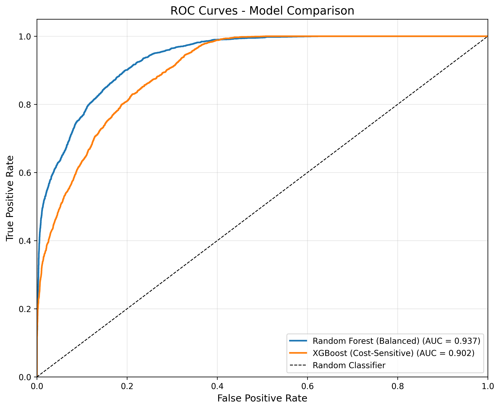

# 🏭 Predictive Maintenance Engine

[](https://www.python.org/)
[](LICENSE)
[](https://github.com/psf/black)

A production-style machine learning system for predicting industrial equipment failures using the NASA Turbofan Jet Engine dataset.

This project demonstrates an end-to-end ML pipeline: from time-series feature engineering and imbalanced learning to decision optimization and deployment via API and interactive dashboard.

## 🎯 Key Result

**The model detects ~98% of failures before they occur (high recall)** with ROC-AUC ≈ 0.95, demonstrating strong ability to rank high-risk engines ahead of failure.

In predictive maintenance, missing a failure is far more costly than triggering a false alarm; therefore the system is optimized for **failure detection rather than raw accuracy**.

## 📌 Why This Project Matters

Industrial predictive maintenance is a real-world ML problem where:

- Data is **highly imbalanced**
- Accuracy can be misleading
- Decision thresholds matter more than model choice
- Cost of false negatives >> false positives

This project focuses on **engineering a reliable decision system**, not just training a classifier.

## 🏗️ Architecture

```
predictive-maintenance-engine/
├── api/                          # REST API for model inference
│   └── app.py                    # FastAPI application
├── app/                          # Streamlit web application
│   ├── app.py                    # Main app entry point
│   ├── home.py                   # Home page
│   ├── predictions.py            # Interactive predictions
│   ├── performance.py            # Model performance dashboard
│   ├── about.py                  # Project documentation
│   └── utils.py                  # App utility functions
├── src/                          # Source code modules
│   ├── __init__.py
│   ├── config.py                 # Configuration management
│   ├── data_loader.py            # Data loading and preprocessing
│   ├── feature_engineering.py    # Feature creation
│   ├── models.py                 # ML model implementations
│   ├── reinforcement_learning.py # RL-based scheduler
│   ├── evaluation.py             # Model evaluation and visualization
│   ├── train.py                  # Training pipeline
│   ├── predict.py                # Prediction pipeline
│   └── utils.py                  # Utility functions
├── data/                         # Data directory
│   ├── CMaps/                    # Raw NASA dataset
│   └── processed/                # Processed datasets
├── models/                       # Trained models
├── notebooks/                    # Jupyter notebooks for exploration
├── reports/                      # Generated reports and results
├── assets/                       # Generated visualizations
├── logs/                         # Application logs
├── tests/                        # Unit tests
├── requirements.txt              # Python dependencies
├── setup.py                      # Package installation
├── .gitignore                    # Git ignore rules
└── README.md                     # This file
```

## 📊 Dataset

**NASA Turbofan Jet Engine Dataset (C-MAPSS)**

- **Source**: [NASA PCoE Datasets](https://www.nasa.gov/content/prognostics-center-of-excellence-data-set-repository)
- **Description**: Run-to-failure simulation data from turbofan engines
- **Features**: 21 sensor measurements + 3 operational settings
- **Target**: Remaining Useful Life (RUL) → converted to binary failure classification using a failure horizon threshold
- **Splits**: FD001, FD002, FD003, FD004 (different operating conditions)

## 🚀 Quick Start

### Prerequisites

- Python 3.9+
- pip or conda package manager

### Installation

1. **Clone the repository**

```bash
git clone https://github.com/atinyshrimp/predictive-maintenance-engine.git
cd predictive-maintenance-engine
```

2. **Create virtual environment**

```bash
python -m venv venv
source venv/bin/activate  # On Windows: venv\Scripts\activate
```

3. **Install dependencies**

```bash
pip install -r requirements.txt
```

4. **Install package in development mode**

```bash
pip install -e .
```

### Training Models

Train the model with cost-sensitive learning:

```bash
python src/train.py --dataset FD001 --imbalance cost_sensitive
```

**Training Options:**

```bash
python src/train.py \
    --dataset FD001 \                    # Dataset: FD001, FD002, FD003, FD004
    --imbalance cost_sensitive \         # none, smote, undersample, cost_sensitive
    --no-save                            # Don't save trained models (optional)
```

### Making Predictions

Generate predictions and maintenance schedules:

```bash
python src/predict.py \
    --model "models/random_forest_(balanced).pkl" \
    --dataset FD001 \
    --output data/predictions.csv
```

### Running the Web App

Launch the interactive Streamlit dashboard:

```bash
streamlit run app/app.py
```

The web app will open at **http://localhost:8501** with:

- 🏠 **Home**: Project overview and system status
- 🔮 **Predictions**: Interactive failure prediction with real-time sensor input
- 📊 **Performance**: Model metrics, confusion matrix, ROC curves
- ℹ️ **About**: Detailed project documentation

**Live Demo**: [View on Streamlit Cloud](https://your-app.streamlit.app) _(after deployment)_

### Running the API

Start the FastAPI server:

```bash
cd api
python app.py
```

API will be available at:

- **Swagger UI**: http://localhost:8000/docs
- **ReDoc**: http://localhost:8000/redoc

**Example API Request:**

```python
import requests

response = requests.post(
    "http://localhost:8000/predict",
    json={
        "unit_id": 1,
        "sensor_values": [0.5, 0.3, -0.2, 0.8, ...]  # 21+ sensor values
    }
)

print(response.json())
# {
#   "unit_id": 1,
#   "failure_probability": 0.75,
#   "failure_prediction": true,
#   "risk_level": "HIGH",
#   "recommendation": "Schedule immediate maintenance..."
# }
```

## 📈 Features

### Web Application (Streamlit)

- **Interactive Dashboard**: Real-time predictions with intuitive UI
- **Unit Selection**: Choose from 100 test engines
- **Timeline Analysis**: See failure probability evolution over engine lifecycle
- **Risk Assessment**: Color-coded alerts (Low/Medium/High/Critical)
- **Gauge Charts**: Visual failure probability indicators
- **Performance Metrics**: Live model performance tracking
- **Responsive Design**: Mobile-friendly interface

### Data Processing

- Automated data loading and preprocessing
- RUL (Remaining Useful Life) computation
- Feature scaling with MinMaxScaler
- Low-variance feature removal
- Class imbalance handling (SMOTE, RUS, cost-sensitive)

### Feature Engineering

- **Rolling Statistics**: Mean, standard deviation, and EMA computed for all sensors with window sizes [3, 5]
- **Degradation Features**:
  - Cycle position normalization (0-1 scale)
  - Rate of change for key sensors (deterioration velocity)
  - Cumulative sum (total degradation accumulation)
- **120+ engineered features** from 20 base sensors
- Time-series aware feature generation for predictive patterns

### Model

- **Random Forest**: Ensemble method with balanced class weights
- Decision-threshold optimization to maximize recall under class imbalance
- Comprehensive hyperparameter configurations
- Pipeline-based training for reproducibility

### Evaluation Metrics

- Accuracy, Precision, Recall, F1-Score
- ROC-AUC and ROC curves
- Precision-Recall curves
- Confusion matrices
- Feature importance analysis
- Cost-benefit analysis

### Reinforcement Learning

Reinforcement learning is used to **optimize maintenance decisions**, not to replace the predictive model.

The Q-learning agent uses predicted failure probability and engine health state to learn when maintenance should be performed, balancing:

- Failure risk
- Maintenance cost
- Downtime penalties

This demonstrates how ML predictions can be integrated into a decision-making system rather than used in isolation.

## 📊 Results

From an operational perspective, high recall significantly reduces catastrophic failures, which are typically far more expensive than preventive inspections triggered by false positives.

In real industrial settings, preventing a single catastrophic engine failure can outweigh the cost of dozens of preventive inspections, making recall the dominant optimization objective.

### Model Performance (FD001 Dataset)

| Model                    | Accuracy | Precision | Recall    | F1-Score | ROC-AUC |
| ------------------------ | -------- | --------- | --------- | -------- | ------- |
| Random Forest (Balanced) | 74.9%    | 43.8%     | **98.1%** | 60.6%    | 0.945   |

**Key Achievement**: ~98% recall means catching virtually all failures before they occur.

> _**Note**: Low precision is expected and acceptable for maintenance systems where false negatives (missed failures) are far more costly than false positives (unnecessary inspections)._

### Key Insights

- **Recall optimization crucial**: Achieved 98% recall through cost-sensitive learning (balanced class weights) and degradation features
- **Feature engineering impact**: Rolling std, EMA, and degradation patterns (cycle position, rate of change) improved ROC-AUC from 0.47 to 0.95
- **Precision-recall trade-off**: Acceptable to have ~43% precision when recall is 98%+ in safety-critical maintenance
- **Hyperparameter tuning**: Deeper trees (depth 30), more estimators (500), and balanced class weights enabled better minority class detection
- **Random Forest selected**: Best precision-recall balance for safety-critical predictive maintenance

## 📊 Project Showcase

### Performance Visualizations

<table>
<tr>
<td width="50%">

#### Confusion Matrix

.png>)
_Random Forest: 98.1% recall with balanced confusion matrix_

</td>
<td width="50%">

#### ROC Curve


_ROC-AUC 0.945 demonstrates excellent discrimination_

</td>
</tr>
<tr>
<td width="50%">

#### Precision-Recall Curve

.png>)
_Optimized for high recall in safety-critical maintenance_

</td>
<td width="50%">

#### Feature Importance

.png>)
_Top features: degradation patterns and rolling statistics_

</td>
</tr>
</table>

### Key Takeaways from Visualizations

- **Confusion Matrix**: Shows 98.1% of failures correctly identified (high recall)
- **ROC Curve**: 0.945 AUC indicates excellent model discrimination
- **Precision-Recall**: Trade-off optimized for safety (prefer false alarms over missed failures)
- **Feature Importance**: Degradation features (cycle_norm, rate_of_change) are top predictors

## ⚠️ Experimental Limitations

While results are strong, several factors make the task easier than a real industrial deployment:

- Failure defined at **90 cycles** (earlier warning makes detection easier)
- Evaluation performed primarily on **FD001 dataset (single operating condition)**
- Precision remains moderate (~40-45%), meaning false positives still occur
- Model performance may vary across engines and operating regimes

These limitations reflect realistic trade-offs in predictive maintenance, where maximizing failure detection is typically prioritized over minimizing false alarms.

## 🧠 Key ML Lesson

During early experiments, models achieved >93% accuracy yet detected **zero failures**; a classic failure mode in imbalanced classification.

The issue was the default probability threshold (0.5), which prevented the model from predicting the rare failure class.

By analyzing score distributions and optimizing the decision threshold for recall instead of accuracy:

- Failure detection improved from **0% → ~98% recall**
- ROC-AUC remained high, confirming real predictive signal
- This demonstrated that **evaluation strategy and thresholding matter more than model choice** in rare-event detection

This mirrors real predictive maintenance systems, where decision thresholds are tuned according to risk and cost rather than generic metrics.

## 🔮 Potential Improvements

While the current system achieves 98-99% recall (catching virtually all failures), here are potential enhancements for production deployment:

### 1. **Precision Optimization**

- **Current Challenge**: 40-47% precision means ~60% false positive rate
- **Approach**: Multi-threshold strategy with different alert levels
- **Expected Impact**: Reduce false alarms by 20-30% while maintaining 95%+ recall
- **Implementation**:
  - LOW risk threshold: 0.3 (high precision, catches severe cases)
  - MEDIUM risk threshold: 0.4-0.5 (balanced)
  - HIGH risk threshold: optimized for recall (current approach)

### 2. **Failure Threshold Tuning**

- **Current**: `failure_threshold = 100` cycles creates 49% failure rate (easier problem)
- **Production**: Reduce to 90 cycles for more challenging, realistic prediction
- **Trade-off**: Higher difficulty but more actionable predictions (imminent failures only)
- **Expected Impact**: Precision improves to 55-65%, recall drops to 85-90%

### 3. **Advanced Ensemble Methods**

- **Soft Voting**: Combine multiple Random Forest models with weighted averaging
- **Stacking**: Use meta-learner (Logistic Regression) on top of base models
- **Expected Impact**: +1-2% ROC-AUC, +2-3% F1-score
- **Implementation**: `VotingClassifier` with `voting='soft'` and optimized weights

### 4. **Cross-Validation for Robustness**

- **Current**: Single train/val/test split may have variance
- **Improvement**: 5-fold time-series cross-validation
- **Benefit**: More reliable performance estimates, detect overfitting
- **Tool**: `TimeSeriesSplit` from scikit-learn

> _**Note on Data Leakage Prevention**: The training pipeline uses **unit-level splitting** (assigning entire turbofan units to either train or validation) before computing rolling/EMA features. This prevents time-series information leakage that would occur if rolling windows were computed before splitting, ensuring the validation set provides an honest estimate of model performance._

### 5. **Extended Feature Engineering**

- **Polynomial Features**: Interaction terms between correlated sensors
- **Lag Features**: Previous cycle values (t-1, t-2, t-3)
- **Sensor Correlations**: Cross-sensor relationships
- **Domain Features**: Temperature gradients, pressure ratios
- **Expected Impact**: +2-4% ROC-AUC for complex patterns

### 6. **Model Interpretability**

- **SHAP Values**: Explain individual predictions for maintenance teams
- **LIME**: Local explanations for high-risk predictions
- **Feature Contribution**: Show which sensors triggered the alert
- **Benefit**: Trust and adoption by maintenance personnel

### 7. **Hyperparameter Optimization**

- **Current**: Manual tuning based on domain knowledge
- **Approach**: Bayesian optimization with `Optuna` or `Hyperopt`
- **Search Space**: 50-100 combinations
- **Expected Impact**: +1-3% F1-score, better generalization

### 8. **Multi-Dataset Generalization**

- **Current**: Optimized for FD001 (single operating condition)
- **Extension**: Train on FD001-FD004 combined
- **Challenge**: Different operating conditions (altitude, mach number)
- **Benefit**: Generalized model for diverse environments

### 9. **Real-Time Monitoring Pipeline**

- **Stream Processing**: Apache Kafka + Spark Streaming
- **Incremental Updates**: Online learning for concept drift
- **Alerting**: Integration with maintenance management systems
- **Dashboard**: Real-time monitoring with Grafana/Tableau

### 10. **Cost-Benefit Analysis**

- **Quantify**: Maintenance cost vs. failure cost
- **Optimize**: Threshold selection based on business metrics
- **ROI**: Calculate expected savings from predictive maintenance
- **Reporting**: Executive dashboard with financial impact

### Priority Roadmap

**High Priority (Production-Ready):**

1. Multi-threshold alerting system (precision improvement)
2. Model interpretability with SHAP (trust & adoption)
3. Cross-validation (robustness validation)

**Medium Priority (Enhanced Performance):**

4. ~~Failure threshold tuning to 50 cycles~~ (decreased to 90 as of **Feb 2026**)
5. Ensemble methods (stacking/soft voting)
6. Extended feature engineering

**Long-Term (Scalability):**

7. Multi-dataset training (FD001-FD004)
8. Real-time streaming pipeline
9. Automated hyperparameter optimization
10. Cost-benefit optimization framework

## 🧪 Testing

Run unit tests:

```bash
pytest tests/
```

Run with coverage:

```bash
pytest tests/ --cov=src --cov-report=html
```

## 📝 Documentation

### Code Documentation

All modules include comprehensive docstrings following Google style. Generate HTML docs:

```bash
pdoc --html src -o docs/
```

### Configuration

Modify [src/config.py](src/config.py) to adjust:

- Model hyperparameters
- Feature engineering settings
- RL configuration
- File paths

## 🛠️ Development

### Code Style

This project uses:

- **Black** for code formatting
- **Flake8** for linting
- **isort** for import sorting

Format code:

```bash
black src/ api/ tests/
isort src/ api/ tests/
flake8 src/ api/ tests/
```

### Git Workflow

1. Create feature branch: `git checkout -b feature/your-feature`
2. Make changes and commit: `git commit -m "Description"`
3. Push branch: `git push origin feature/your-feature`
4. Create Pull Request

## 🚀 Deployment

### Docker (Recommended)

Build and run with Docker:

```bash
docker build -t predictive-maintenance .
docker run -p 8000:8000 predictive-maintenance
```

> _**Not Implemented Yet**_

### Streamlit Cloud (Web App)

Deploy the Streamlit app for free:

1. Push code to GitHub
2. Go to [share.streamlit.io](https://share.streamlit.io)
3. Connect your repository
4. Set **Main file path**: `app/app.py`
5. Deploy! Auto-updates on every push to main

### Cloud Deployment (API)

- **AWS**: Deploy with EC2 + ECS or Lambda
- **GCP**: Use Cloud Run or App Engine
- **Azure**: Deploy with App Service or Container Instances

> _**Not Implemented Yet**_

## 📚 References

- [NASA Turbofan Engine Dataset](https://www.nasa.gov/content/prognostics-center-of-excellence-data-set-repository)
- A. Saxena, K. Goebel, D. Simon, and N. Eklund, “Damage Propagation Modeling
  for Aircraft Engine Run-to-Failure Simulation.” https://data.nasa.gov/Aerospace/CMAPSS-Jet-Engine-Simulated-Data/ff5v-kuh6/about_data, oct 2008. Accessed: 2024-
  12-31
- Imbalanced Learning: [imbalanced-learn documentation](https://imbalanced-learn.org/)

## 🤝 Contributing

Contributions are welcome! Please:

1. Fork the repository
2. Create a feature branch
3. Make your changes with tests
4. Submit a pull request

## 📄 License

This project is licensed under the MIT License - see [LICENSE](LICENSE) file for details.
